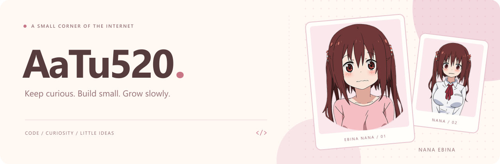

<picture>
  <source media="(prefers-color-scheme: dark)" srcset="./header-collage-dark.png">
  <source media="(prefers-color-scheme: light)" srcset="./header-collage-light.png">
  
</picture>

  <a href="https://github.com/AaTu520/AaTu_Chunks">AaTu_Chunks</a>
  &nbsp;&nbsp; / &nbsp;&nbsp;
  <a href="https://github.com/AaTu520?tab=repositories&amp;type=source">All Projects</a>
  &nbsp;&nbsp; / &nbsp;&nbsp;
  <a href="https://github.com/AaTu520?tab=stars">Stars</a>

 

### Hi, I'm Aa_Tu 🌸

Building things I enjoy, one idea at a time.

This is my little corner for projects, experiments, and things I learn.  
Usually tinkering with Minecraft, with a little inspiration from Nana Ebina.

 

### Languages & Technologies

  <code>Python</code> &nbsp;
  <code>C#</code> &nbsp;
  <code>Vue</code> &nbsp;
  <code>Go</code> &nbsp;
  <code>Java</code> &nbsp;
  <code>SQL</code>

 

### My Projects

<table width="100%">
  <tr>
    <td>
      01 / PERSONAL PROJECT
      <h3><a href="https://github.com/AaTu520/AaTu_Chunks">AaTu_Chunks ↗</a></h3>
      
<strong>Creative mode in designated Minecraft regions.</strong>

      
Enter a designated region to use selected items without limits.

      
<code>Minecraft</code> &nbsp; <code>Creative Regions</code> &nbsp; <code>Unlimited Items</code>

      Start with a region. Build your next idea.
    </td>
  </tr>
</table>

  <a href="https://github.com/AaTu520?tab=repositories&amp;type=source">More projects →</a>

 

---

  <samp>STAY CURIOUS. KEEP CREATING.</samp> 
  Thanks for stopping by. Have a great day. 
  Nana Ebina artwork from the <a href="https://umaru-ani.me/character/">official anime website</a>.

